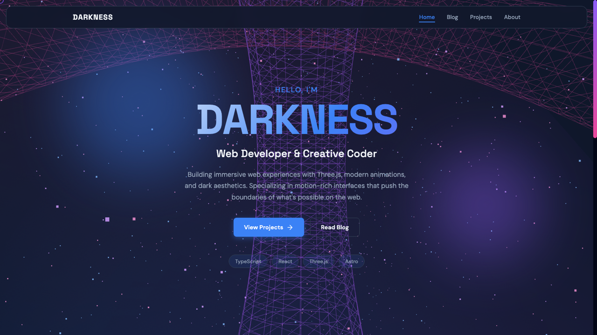
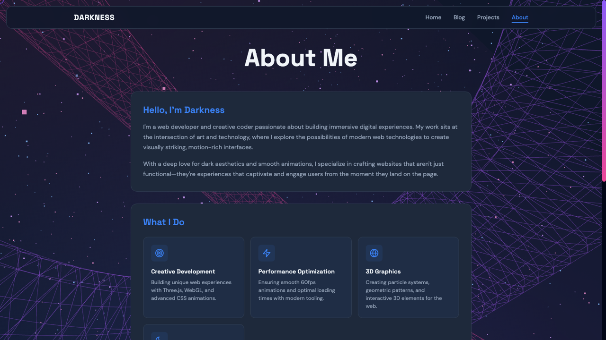
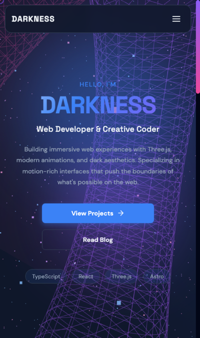

# Darkness — Astro Portfolio & Blog Theme

**The only Astro theme with a live 5,000-particle Three.js background.** A production-ready dark portfolio + blog template with modern typography, smooth animations, and a fully responsive design — built on Astro 6.

[](https://github.com/kpab/astro-darkness/stargazers)
[](https://github.com/kpab/astro-darkness/releases)
[](https://astro.build/)
[](https://threejs.org/)
[](LICENSE)

**[Live Demo](https://kpab.github.io/astro-darkness)** · **[Get Started](#quick-start)** · **[Star this repo](https://github.com/kpab/astro-darkness)** if it helps you!



## Deploy in one click

[](https://vercel.com/new/clone?repository-url=https://github.com/kpab/astro-darkness)
[](https://app.netlify.com/start/deploy?repository=https://github.com/kpab/astro-darkness)

## Why Darkness?

Most dark themes are just a flipped color palette. **Darkness ships a real WebGL experience** — an animated 5,000-particle starfield that reacts as you scroll — without sacrificing performance or accessibility.

- **Three.js particle background** — 5,000 animated particles, GPU-accelerated
- **Blog system** — powered by Astro Content Collections + MDX
- **Portfolio** — project showcase with featured highlighting
- **Responsive** — mobile-first design with a floating navbar
- **Easy theming** — change the whole look from a handful of CSS variables
- **Astro 6** — ships zero JS by default, sitemap + SEO ready
- **TypeScript** — type-safe content and components

## Screenshots

| Blog | Projects |
|------|----------|
|  |  |
| **About** | **Mobile** |
|  |  |

## Quick Start

> Requires **Node.js 22+** (Astro 6).

```bash
# Clone this template
git clone https://github.com/kpab/astro-darkness.git
cd astro-darkness

# Install dependencies
npm install

# Start dev server
npm run dev

# Build for production
npm run build
```

## Adding Content

### Blog Posts

Create markdown files in `src/content/blog/`:

```markdown
---
title: 'Your Post Title'
description: 'Brief description'
pubDate: 2025-12-15
tags: ['astro', 'three.js']
---

Your content here...
```

### Projects

Create markdown files in `src/content/projects/`:

```markdown
---
title: 'Your Project'
description: 'Project description'
github: 'https://github.com/...'
tags: ['react', 'typescript']
featured: true
---
```

## Customization

Edit CSS variables in `src/styles/global.css`:

```css
:root {
  --color-bg-dark: #0F172A;
  --color-primary: #3B82F6;
  --color-accent-purple: #8B5CF6;
  --font-heading: 'Space Grotesk', sans-serif;
  --font-body: 'DM Sans', sans-serif;
}
```

## Project Structure

```
src/
├── components/    # Reusable components
├── content/       # Blog posts & projects (Markdown)
├── layouts/       # Page layouts
├── pages/         # Routes
└── styles/        # Global styles
```

## Tech Stack

- [Astro](https://astro.build/) - Static site generator
- [Three.js](https://threejs.org/) - 3D graphics
- [TypeScript](https://www.typescriptlang.org/) - Type safety
- Google Fonts (Space Grotesk + DM Sans)

## Support

If Darkness saved you time, please **[give it a star on GitHub](https://github.com/kpab/astro-darkness)** — it helps others discover the theme and motivates further development.

## License

MIT - see [LICENSE](LICENSE)

---

Made by [kpab](https://github.com/kpab)
